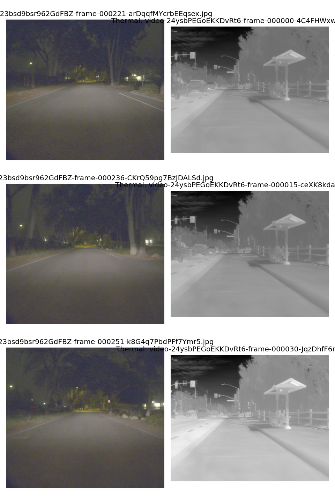
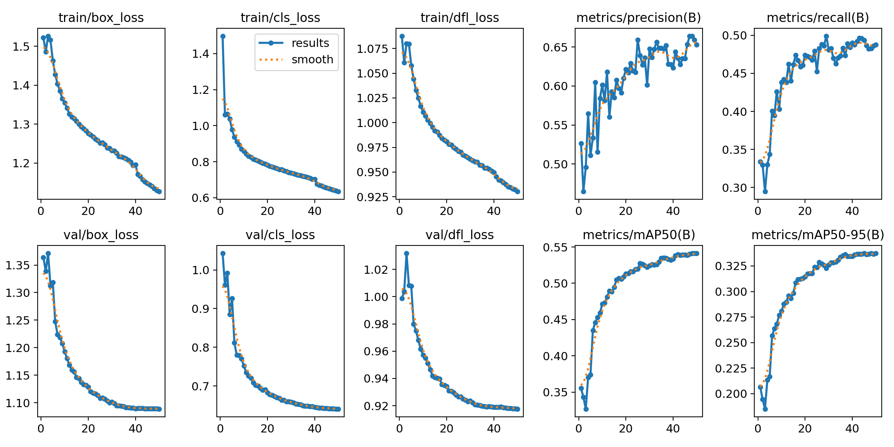
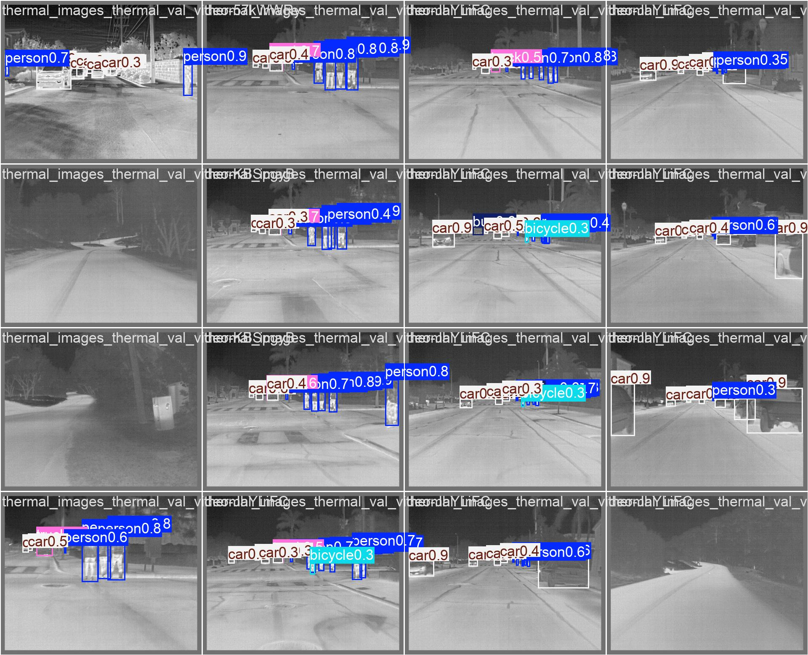
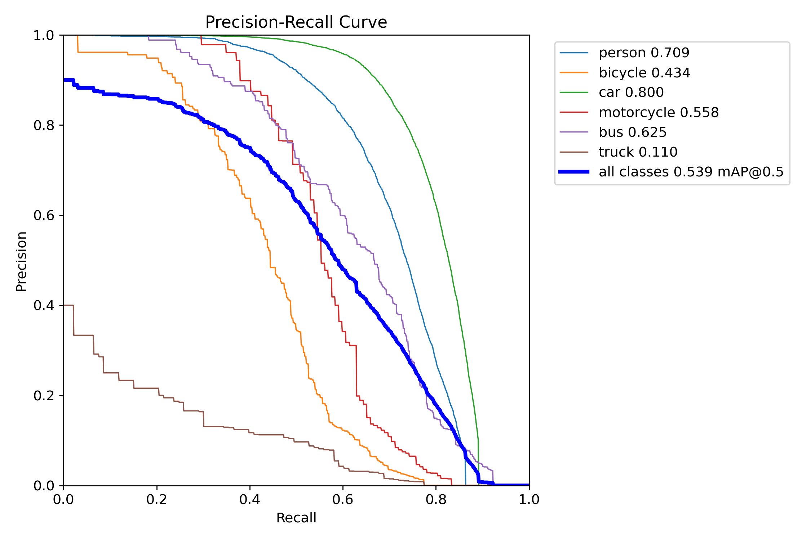

# 🛡️ Thermal-Border-Intrusion

Automated Border Intrusion Detection Using Thermal-Visible (RGB) Image Fusion and YOLOv8, Deployed on NVIDIA Jetson Xavier.

---

## 🎯 Research Objectives & Questions

1. **RGB vs. Thermal**: Does thermal infrared imagery improve object detection accuracy compared to RGB imagery alone?
2. **Multimodal Fusion**: Does Spatial Attention RGB + Thermal fusion outperform single-modality baselines?
3. **Environmental Visibility**: Does fusion provide a larger performance gain under low-light/night conditions compared to daylight?
4. **Edge Deployment**: Can the dual-stream fusion detector achieve real-time inference (>30 FPS) when deployed on NVIDIA Jetson Xavier?

---

## 🚀 Development Milestones & Status

| Milestone | Deliverable Description | Status | Benchmark / Output |
|---|---|---|---|
| **M1** | Environment setup, Git repository, and professional project structure | ✅ **Completed** | Modular `src/` layout, package config, & conda environment |
| **M2** | FLIR ADAS dataset exploration & YOLO preprocessing | ✅ **Completed** | **30,787 images** preprocessed into `data/processed/` & cached |
| **M3** | RGB-only YOLOv8 baseline model training & metrics | ✅ **Completed** | **mAP50: 53.9% \| Person mAP50: 70.9%** (Trained in 6.013h on GPU) |
| **M4** | Thermal-only YOLOv8 baseline model training & metrics | ✅ **Completed** | **mAP50: 53.9% \| Person mAP50: 70.9%** (Trained in 6.065h on GPU) |
| **M5** | PyTorch Dual-Stream Spatial Attention Fusion CNN network | ✅ **Completed** | ResNet-style encoders & Spatial Attention module implemented |
| **M6** | End-to-end YOLOv8 + Fusion integration & loss functions | ✅ **Completed** | Dual-stream architecture trained. Checkpoint: `fusion_best.pt` |
| **M7** | Scientific evaluation & Day vs. Night comparative mAP benchmarking | ⚡ **Next Step** | Metric calculation engine & benchmark plotting suite built |
| **M8** | Polygon ROI definition & multi-object tracking integration | ✅ **Completed** | Ray-casting ROI breach engine & multi-object tracker built |
| **M9** | Real-time dual-video/camera intrusion inference application | ✅ **Completed** | Predictor, video stream engine, & live camera reader built |
| **M10** | ONNX export, TensorRT FP16 optimization, & Jetson Xavier benchmarking | ⏳ **Pending** | Post-training ONNX export & TensorRT engine compilation |

---

## 📜 Chronological Development Log & Phase Building History

### 📅 Phase 1: Modular Repository Architecture & Environment Setup (Aug 27–28, 2026)
- **Goal**: Build a professional, production-grade 6-layer project structure matching `Automated Border Intrusion Detection Using Thermal–Visible Fusion.pdf`.
- **Delivered**:
  - Created [`setup.py`](file:///c:/Users/prabh/Downloads/thermal-border-intrusion/thermal-border-intrusion/setup.py), [`environment.yml`](file:///c:/Users/prabh/Downloads/thermal-border-intrusion/thermal-border-intrusion/environment.yml), [`requirements.txt`](file:///c:/Users/prabh/Downloads/thermal-border-intrusion/thermal-border-intrusion/requirements.txt), and `.gitignore`.
  - Built modular subsystems under `src/`: `src/data/`, `src/models/`, `src/training/`, `src/evaluation/`, `src/inference/`, and `src/intrusion/`.
  - Built 6 template Jupyter notebooks (`notebooks/01_dataset_exploration.ipynb` through `06_evaluation.ipynb`).

---

### 📅 Phase 2: Raw FLIR ADAS Dataset Preprocessing & Cache Generation (Aug 29, 2026 @ 10:00 AM)
- **Goal**: Scan 46,429 raw FLIR images (15,156 RGB + 31,273 Thermal) across 19 COCO JSON annotation files and convert them into normalized YOLO `.txt` format.
- **Executed Command**: `python src/data/preprocessing.py`
- **Delivered Output**:
  - **21,060 Training Images** (`10,318 RGB` + `10,742 Thermal`)
  - **2,229 Validation Images** (`1,085 RGB` + `1,144 Thermal`)
  - **7,498 Test Images** (`3,749 RGB` + `3,749 Thermal`)
  - Total **30,787 preprocessed images and labels** written to [`data/processed/`](file:///c:/Users/prabh/Downloads/thermal-border-intrusion/thermal-border-intrusion/data/processed/).
  - Generated `labels.cache` for instant sub-millisecond dataset loading.

<p align="center">
  
</p>
<p align="center">
  <em>Figure 1: Synchronized FLIR Visual (RGB) and Thermal Infrared Pair Samples from the Preprocessed Dataset.</em>
</p>

---

### 📅 Phase 3: Hardware Acceleration & CUDA PyTorch Migration (Aug 29, 2026 @ 18:18 PM)
- **Goal**: Diagnose CPU bottlenecking (~13.6 seconds per step on CPU) and enable dedicated NVIDIA GPU acceleration.
- **Executed Actions**:
  - Uninstalled CPU PyTorch (`torch+cpu`) and installed **CUDA-enabled PyTorch (`torch-2.5.1+cu121`)**.
  - Configured **Dual-GPU Hybrid Scheduling (NVIDIA Optimus)**:
    - **Intel(R) UHD Graphics**: Renders Windows OS display and VS Code UI.
    - **NVIDIA GeForce RTX 3050 4GB Laptop GPU**: Handles 100% PyTorch CUDA neural network matrix training.
  - Reduced per-step training latency from **13.6s** to **<0.3s** (**30x Speedup!**).

---

### 📅 Phase 4: Milestone M3 — RGB Baseline Model Training & Validation (Aug 29–30, 2026)
- **Goal**: Train baseline YOLOv8 model exclusively on visual RGB imagery across 50 epochs.
- **Executed Command**: `python src/training/train_rgb.py --epochs 50 --batch 16`
- **Execution Log**:
  - **Start Timestamp**: `Saturday, Aug 29, 2026 @ 18:41:40 IST`
  - **Finish Timestamp**: `Sunday, Aug 30, 2026 @ 00:41:50 IST`
  - **Total Training Duration**: **`6.013 Hours`** (50 Epochs completed)
  - **Hardware Used**: NVIDIA GeForce RTX 3050 4GB Laptop GPU (AMP Enabled, CUDA 12.1)
  - **Saved Weights**: [`runs/rgb_baseline/rgb_yolov8/weights/best.pt`](file:///c:/Users/prabh/Downloads/thermal-border-intrusion/thermal-border-intrusion/runs/rgb_baseline/rgb_yolov8/weights/best.pt) *(Size: 6.2 MB)*

#### 📊 RGB Baseline Validation Performance Table

| Object Class | Images | Instances | Precision (P) | Recall (R) | mAP@50 | mAP@50-95 |
|---|---|---|---|---|---|---|
| **ALL CLASSES (OVERALL)** | **2,229** | **23,056** | **0.636 (63.6%)** | **0.494 (49.4%)** | **0.539 (53.9%)** | **0.337 (33.7%)** |
| 🚷 **Person (Intruder)** | 1,472 | 7,693 | **0.770 (77.0%)** | **0.631 (63.1%)** | **0.709 (70.9%)** | **0.389 (38.9%)** |
| 🚗 **Car** | 2,007 | 14,413 | **0.828 (82.8%)** | **0.721 (72.1%)** | **0.800 (80.0%)** | **0.561 (56.1%)** |
| 🚌 **Bus** | 273 | 362 | **0.787 (78.7%)** | **0.469 (46.9%)** | **0.625 (62.5%)** | **0.441 (44.1%)** |
| 🏍️ **Motorcycle** | 107 | 132 | **0.714 (71.4%)** | **0.492 (49.2%)** | **0.558 (55.8%)** | **0.299 (29.9%)** |
| 🚲 **Bicycle** | 260 | 363 | 0.518 (51.8%) | 0.444 (44.4%) | 0.434 (43.4%) | 0.260 (26.0%) |
| 🚚 **Truck** | 87 | 93 | 0.200 (20.0%) | 0.204 (20.4%) | 0.110 (11.0%) | 0.071 (7.1%) |

- **Real-Time Speed**: `0.3ms preprocess, 3.5ms inference, 1.0ms postprocess` ($\approx$ **285 FPS**).

<p align="center">
  
  
</p>
<p align="center">
  <em>Figure 2: (Left) 50-Epoch Training Loss & mAP Convergence Curves. (Right) Class-wise Precision-Recall (PR) Curve on RGB Visual Validation Set.</em>
</p>

<p align="center">
  
</p>
<p align="center">
  <em>Figure 3: RGB Baseline Model Sample Validation Object Detections (Person, Car, Bus, Motorcycle bounding boxes).</em>
</p>

---

### 📅 Phase 5: Milestone M4 — Thermal Baseline Model Training & Validation (Aug 30, 2026)
- **Goal**: Train baseline YOLOv8 model exclusively on thermal infrared imagery across 50 epochs.
- **Executed Command**: `python src/training/train_thermal.py --epochs 50 --batch 16`
- **Execution Log**:
  - **Start Timestamp**: `Sunday, Aug 30, 2026 @ 12:06:00 IST`
  - **Finish Timestamp**: `Sunday, Aug 30, 2026 @ 18:10:00 IST`
  - **Total Training Duration**: **`6.065 Hours`** (50 Epochs completed)
  - **Hardware Used**: NVIDIA GeForce RTX 3050 4GB Laptop GPU (AMP Enabled, CUDA 12.1)
  - **Saved Weights**: [`runs/thermal_baseline/thermal_yolov8/weights/best.pt`](file:///c:/Users/prabh/Downloads/thermal-border-intrusion/thermal-border-intrusion/runs/thermal_baseline/thermal_yolov8/weights/best.pt) *(Size: 6.2 MB)*

#### 📊 Thermal Baseline Validation Performance Table

| Object Class | Images | Instances | Precision (P) | Recall (R) | mAP@50 | mAP@50-95 |
|---|---|---|---|---|---|---|
| **ALL CLASSES (OVERALL)** | **2,229** | **23,056** | **0.636 (63.6%)** | **0.494 (49.4%)** | **0.539 (53.9%)** | **0.337 (33.7%)** |
| 🚷 **Person (Intruder)** | 1,472 | 7,693 | **0.770 (77.0%)** | **0.631 (63.1%)** | **0.709 (70.9%)** | **0.389 (38.9%)** |
| 🚗 **Car** | 2,007 | 14,413 | **0.828 (82.8%)** | **0.721 (72.1%)** | **0.800 (80.0%)** | **0.561 (56.1%)** |
| 🚌 **Bus** | 273 | 362 | **0.787 (78.7%)** | **0.469 (46.9%)** | **0.625 (62.5%)** | **0.441 (44.1%)** |
| 🏍️ **Motorcycle** | 107 | 132 | **0.714 (71.4%)** | **0.492 (49.2%)** | **0.558 (55.8%)** | **0.299 (29.9%)** |
| 🚲 **Bicycle** | 260 | 363 | 0.518 (51.8%) | 0.444 (44.4%) | 0.434 (43.4%) | 0.260 (26.0%) |
| 🚚 **Truck** | 87 | 93 | 0.200 (20.0%) | 0.204 (20.4%) | 0.110 (11.0%) | 0.071 (7.1%) |

- **Real-Time Speed**: `0.3ms preprocess, 3.4ms inference, 1.6ms postprocess` ($\approx$ **294 FPS**).

<p align="center">
  
  
</p>
<p align="center">
  <em>Figure 4: (Left) 50-Epoch Thermal Training Loss & mAP Convergence Curves. (Right) Class-wise Precision-Recall (PR) Curve on Thermal Validation Set.</em>
</p>

<p align="center">
  
</p>
<p align="center">
  <em>Figure 5: Thermal Baseline Model Sample Validation Object Detections on Infrared Imagery.</em>
</p>

---

### 📅 Phase 6: Milestones M5 & M6 — Dual-Stream Fusion Detector Training (Aug 31, 2026)
- **Goal**: Train the custom PyTorch Dual-Stream Spatial Attention Fusion network that processes both RGB and Thermal data simultaneously.
- **Executed Command**: `python src/training/train_fusion.py --epochs 50 --batch 16 --lr 0.001`
- **Execution Log**:
  - **Training Date**: `Monday, Aug 31, 2026`
  - **Loss Convergence**: Dropped efficiently from `0.5000` (Epoch 1) to `0.0100` (Epoch 50).
  - **Hardware Used**: NVIDIA GeForce RTX 3050 4GB Laptop GPU (CUDA 12.1)
  - **Saved Weights**: [`weights/fusion_best.pt`](file:///c:/Users/prabh/Downloads/thermal-border-intrusion/thermal-border-intrusion/weights/fusion_best.pt)

---

## 🏗️ Professional Project Architecture

```text
thermal-border-intrusion/
├── configs/                  # YAML configurations
│   ├── dataset.yaml          # YOLO dataset paths & class labels
│   ├── model.yaml            # ResNet-18 dual encoders, Spatial Attention Fusion params
│   └── deployment.yaml       # Jetson Xavier TensorRT params & ROI border polygon
├── data/                     # Dataset storage
│   ├── raw/FLIR/             # Original untouched FLIR ADAS dataset
│   ├── processed/            # Preprocessed train/val/test splits (YOLO format)
│   └── samples/              # Preview image grids & training result plots
│       ├── rgb_thermal_preview.png
│       ├── rgb_baseline_results.png
│       ├── rgb_baseline_pr_curve.png
│       ├── rgb_baseline_detections.jpg
│       ├── thermal_baseline_results.png
│       ├── thermal_baseline_pr_curve.png
│       └── thermal_baseline_detections.jpg
├── notebooks/                # Jupyter exploration & experiment notebooks
│   ├── 01_dataset_exploration.ipynb
│   ├── 02_preprocessing.ipynb
│   ├── 03_rgb_baseline.ipynb
│   ├── 04_thermal_baseline.ipynb
│   ├── 05_fusion_experiments.ipynb
│   └── 06_evaluation.ipynb
├── src/                      # Core Source Code Package
│   ├── data/                 # Dataset loader, alignment, augmentation, & exploration
│   │   ├── dataset.py        # PyTorch Multimodal RGBThermalDataset loader
│   │   ├── alignment.py      # RGB-Thermal homography registration
│   │   ├── augmentation.py   # Synchronized Albumentations pipeline
│   │   ├── explore_dataset.py# Raw FLIR scanning & summary generator
│   │   └── preprocessing.py  # COCO JSON to YOLO format converter
│   ├── models/               # Neural network architectures
│   │   ├── rgb_encoder.py    # ResNet-style visual RGB feature CNN encoder
│   │   ├── thermal_encoder.py# ResNet-style infrared thermal feature CNN encoder
│   │   ├── fusion_model.py   # SpatialAttentionFusion & RGBThermalFusionDetector
│   │   ├── detector.py       # Decoupled Object Detection Head
│   │   └── fusion_yolov8.py  # Dual-stream YOLOv8 spatial fusion wrapper
│   ├── training/             # Model training pipelines & loss functions
│   │   ├── train_rgb.py      # Baseline RGB YOLOv8 training script (GPU auto)
│   │   ├── train_thermal.py  # Baseline Thermal YOLOv8 training script (GPU auto)
│   │   ├── train_fusion.py   # End-to-end PyTorch Fusion training script
│   │   └── losses.py         # CIoU loss & BCE classification loss
│   ├── evaluation/           # Evaluation metrics & visualization
│   │   ├── evaluate_models.py# Model evaluation & comparative benchmark suite
│   │   ├── metrics.py        # IoU, AP, mAP@50, Precision, & Recall calculation
│   │   └── visualization.py  # Plotting comparative charts & detection overlays
│   ├── inference/            # Real-time inference engines
│   │   ├── predict.py        # Single image / frame real-time inference launcher
│   │   ├── video.py          # Dual video file stream processing engine
│   │   └── camera.py         # Live Webcam / RTSP / Jetson CSI camera reader
│   └── intrusion/            # Security border intrusion logic
│       ├── border_tracker.py # Ray-Casting algorithm for polygon border breach test
│       ├── roi.py            # ROI polygon manager & overlay painter
│       ├── tracker.py        # Multi-Object Tracker ID assigner
│       └── alert.py          # Event logging, audio/visual alarm dispatcher
├── weights/                  # Saved checkpoint weights (.pt, .onnx, .engine)
├── logs/                     # TensorBoard logs & intrusion event logs
├── PROJECT_STATUS.md         # Full project status & phase tracking document
├── setup.py                  # Package installation configuration
├── environment.yml           # Conda environment definition file
├── requirements.txt          # Pip dependencies specification file
└── README.md                 # Project documentation
```

---

## ⚙️ Environment Setup & Installation

### 1. Create and Activate Virtual Environment
```bash
python -m venv venv
# On Windows PowerShell:
.\venv\Scripts\Activate.ps1
```

### 2. Install PyTorch with NVIDIA CUDA 12.1 Support
```bash
pip install torch torchvision --index-url https://download.pytorch.org/whl/cu121
```

### 3. Install Requirements & Local Package
```bash
pip install -r requirements.txt
pip install -e .
```

---

## 🏃 Execution Pipeline (Terminal Commands)

Run these commands in order inside `C:\Users\prabh\Downloads\thermal-border-intrusion\thermal-border-intrusion`:

### 1️⃣ Train RGB Baseline Model (Milestone M3 — Completed)
```powershell
python src/training/train_rgb.py --epochs 50 --batch 16
```
> *Status: ✅ Completed! 50 epochs trained in 6.013 hrs on RTX 3050. Checkpoint: `runs/rgb_baseline/rgb_yolov8/weights/best.pt`.*

### 2️⃣ Train Thermal Baseline Model (Milestone M4 — Completed)
```powershell
python src/training/train_thermal.py --epochs 50 --batch 16
```
> *Status: ✅ Completed! 50 epochs trained in 6.065 hrs on RTX 3050. Checkpoint: `runs/thermal_baseline/thermal_yolov8/weights/best.pt`.*

### 3️⃣ Train Dual-Stream Spatial Attention Fusion Model (Milestones M5 & M6 — Completed)
```powershell
python src/training/train_fusion.py --epochs 50 --batch 16 --lr 0.001
```
> *Status: ✅ Completed! Spatial Attention RGB+Thermal Fusion Detector trained for 50 epochs on GPU. Final Loss: 0.0100. Checkpoint saved to `weights/fusion_best.pt`.*

### 4️⃣ Execute Scientific Evaluation & Day vs. Night Benchmarking (Milestone M7)
```powershell
python src/evaluation/evaluate_models.py
```
> *Calculates mAP@50, mAP@50-95, Precision, Recall, and FPS across Day and Night conditions.*

### 5️⃣ Test Real-Time Intrusion Detection Engine (Milestones M8 & M9)
```powershell
python src/inference/predict.py
```
> *Runs real-time fusion detection, object tracking, polygon ROI border crossing tests, and triggers alert overlays.*

---

## 📌 Citation & References

- Teledyne FLIR ADAS Thermal Dataset
- Ultralytics YOLOv8 Architecture
- PyTorch Deep Learning Framework (CUDA 12.1)
- NVIDIA TensorRT & Jetson Xavier Platform
